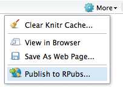

productivity with rstudio
====
author: ben best <bbest@nceas.ucsb.edu>
date: 2014-04-03 in Santa Barbara, CA USA

overview
====
incremental: true

1. data wrangling
  * tool: **dplyr**
1. documenting
  * tool: **markdown**
1. versioning
  * tool: **github**

inspiration
====


1. data wrangling with dplyr
====
type: section

what is dplyr?
====
incremental: true

* **d**plyr is the next iteration of **plyr**, focussed on tools for working with **d**ata frames.

* 

old: plyr
====

```r
library(Lahman)
library(plyr)

games <- ddply(Batting, "playerID", summarise, total = sum(G))
head(arrange(games, desc(total)), 5)
```

```
   playerID total
1  rosepe01  3562
2 yastrca01  3308
3 aaronha01  3298
4 henderi01  3081
5  cobbty01  3035
```


new: dplyr chaining %.%
====

```r
library(Lahman)
library(dplyr)

Batting %.%
  group_by(playerID) %.%
  summarise(total = sum(G)) %.%
  arrange(desc(total)) %.%
  head(5)
```

```
Source: local data frame [5 x 2]

   playerID total
1  rosepe01  3562
2 yastrca01  3308
3 aaronha01  3298
4 henderi01  3081
5  cobbty01  3035
```


dplyr concepts
====
incremental: true

* **grammar of data manipulation**: sequence of operations on a dataset, rather than setting temporary variables or nesting functions inside one another

* **readable**: minimal quoting needed, operations are easily aligned with another (especially with `merge()`)

* **fast**: written largely in C++, faster than `base` functions

* **generic**: regardless of backend storage (data.frame, database, Goolge bigquery...)


2. documenting with markdown
====
type: section

what is markdown?
====
incremental: true

* **markdown** is a plain text formatting syntax for conversion to HTML (with a tool)

* **r markdown** enables easy authoring of reproducible web reports from R

* in **rstudio**

  

embedding r code
====
incremental: true

* **chunks**: text, tables, figures

  

* **inline**: ``pi=`r pi` `` evaluates to "pi=3.1416"

embedding equations
====

* **inline**

  ```
  The Arithmetic mean is equal to $\frac{1}{n} \sum_{i=i}^{n} x_{i}$, or the summation of n numbers divided by n.
  ```

  The Arithmetic mean is equal to $\frac{1}{n} \sum_{i=i}^{n} x_{i}$, or the summation of n numbers divided by n.

embedding equations (2)
====
* **chunked**

```
$$
\frac{1}{n} \sum_{i=i}^{n} x_{i}
$$
```

$$
\frac{1}{n} \sum_{i=i}^{n} x_{i}
$$

online friendly
====
incremental: true

* post to **rpubs** from rstudio

  

  * this presentation
    http://rpubs.com/bdbest/rprod
  
  * more on [Authoring R Presentations](http://www.rstudio.com/ide/docs/presentations/overview)     

* post to **github**

  * natively renders markdown (*.md)
  
  * easy to see change in simple text files (vs binary / proprietary formats)


3. versioning with github
====
type: section

why version?
===
incremental: true

* **backup**: offsite archive (if syncing with remote server)

* **rewind**: roll back changes, so you can experiment and/or clean up code without worry of loss

* **document**: associate changes of code and files with issues and messages

* **collaborate**: with others

* **publish** to web site (github free for public repositories)


github process
===
incremental: true

1. **sign** up at [github.com](http://github.com)

1. **install** [git](http://git-scm.com/downloads) and [github](https://help.github.com/articles/set-up-git)

1. **create** or **fork** a repository, aka "repo"

1. **clone** from web to your local desktop

1. **commit** changes locally

1. **push** changes to your repo

1. **pull** request changes from your repo to `upstream`

github process (2)
====

| direction | org web                  | user web                   | user local          |
| --------- | -----------------------  | -------------------------- | ------------------- |
|           | `github.com/[org]/[repo]`| `github.com/[user]/[repo]` |   `~/github/[repo]` |
| -> (1x)   |                          | -> [fork](https://help.github.com/articles/fork-a-repo)  | -> [clone](https://help.github.com/articles/fetching-a-remote)    |
| <- |  [merge](https://help.github.com/articles/merging-a-pull-request) {admin} <- | <- [pull request](https://help.github.com/articles/creating-a-pull-request) | <- [push](https://github.com/OHI-Science/ohiprep/wiki/Setup#rstudio), <-> [commit](https://github.com/OHI-Science/ohiprep/wiki/Setup#rstudio) |

where:
* `[org]` is an organization (eg ohi-science)
* `[repo]` is a repository in the orgranization (eg ohicore, ohiprep, etc.)
* `[user]` is your github username

github in rstudio
====

RStudio: File > New Project > Version Control

* **clone**

  

github in rstudio (2)
====
* **commit** and **push**

  

github in rstudio (3)
====


this presentation
====

* **rpub**: http://rpubs.com/bdbest/rprod

* **raw**: http://github.com/bbest/bbest.github.com/tree/master/talks/2014-04-03_R-productivity/index.Rpres

* **rendered**: http://bbest.github.io/talks/2014-04-03_R-productivity

more info
====

* **book**: Reproducible Research with R and RStudio (2013) by Christopher Gandrud
   http://christophergandrud.github.io/RepResR-RStudio/

* **dplyr**: http://cran.r-project.org/web/packages/dplyr
   
* **markdown**: http://www.rstudio.com/ide/docs/authoring/using_markdown
   
* **github**: https://www.rstudio.com/ide/docs/version_control/overview
 
