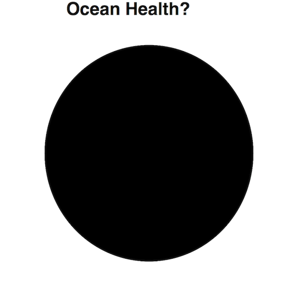
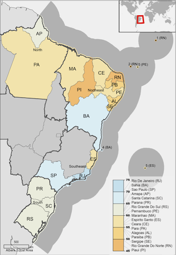
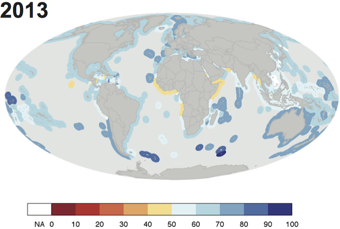
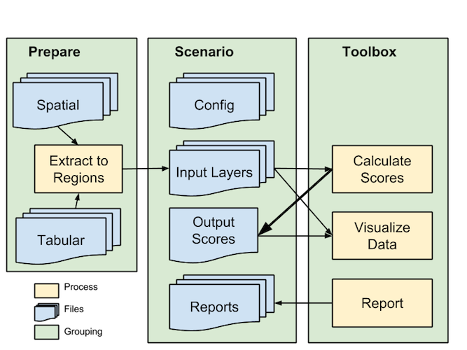
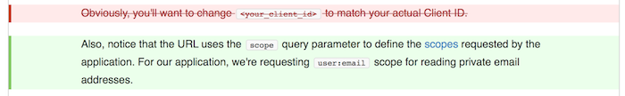
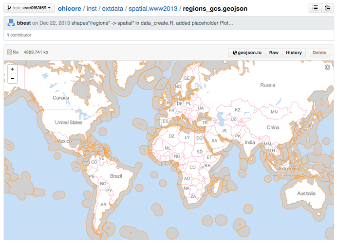
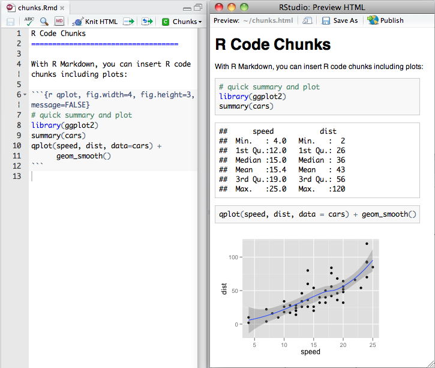
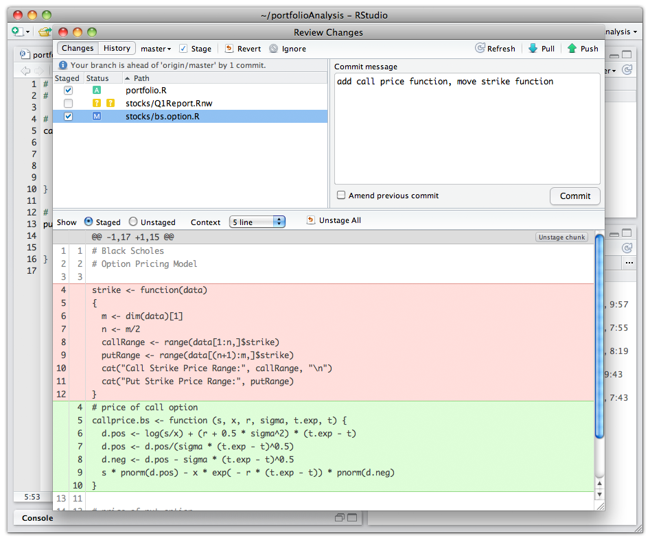

## Why "Reproducible Science" Talk?

- Training for Ocean Health Index regionaliziation: Canada, China, Israel, Baltic, S America

- Topic from local Meetups: R, Data Science

- 

- Why I love Github, R and RStudio

## Outline

- Ocean Health Index
- OHI Toolbox
- Github
- RStudio
- Data wrangling

## What is a Healthy Ocean?

* Is it pristine?

  

* "A healthy ocean _sustainably_ delivers a range of _benefits_ to _**people**_ _now_ and in the _future_."

## 



## 


## 


## 


## 


## Dimensions


## Toolbox Goals
- **Recalculate** OHI globally or regionally using alternative weights, equations, layers, etc.
- **Regionalize** based on administrative boundaries finer than EEZ.
- **Visualize** results to highlight best opportunities for improving ocean health.
- **Interface** with easy-to-use forms for sliding weights and concocting scenarios.
- **Automate** with tools for manipulating input layers and calculating OHI scores for sensitivity analyses.

## Regionalize

<div class="columns-2">

**US West Coast**
Halpern et al (2014) _PLoS ONE_


**Brazil**
Elfes et al (2014) _PLoS ONE_


</div>

## Visualize

**Flower**


## Visualize

**Map**



## Process



## Toolbox

```{r, echo = FALSE, eval=F}
suppressPackageStartupMessages({
  library(shiny)
  library(devtools)
  load_all('~/github/ohicore', quiet=T) })

launch_app('~/ohi-global/eez2013', launch=F)
appDir='~/github/ohicore/inst/shiny_app'
source(file.path(appDir, 'global.R'), keep.source=T, encoding='UTF-8')
shinyAppDir(
  appDir,
  options=list(
    width="100%", height=700))
```

## Regionalization Strategy

- examples
    - [Baltic](https://github.com/OHI-Science/ohiprep/tree/master/Baltic/StockholmUniversity-Regions_v2014-04#figure)
    - Israel [biogeographic](https://github.com/ohi-science/ohiprep/tree/master/Israel/Hamaarag-Regions_v2014a#israel-hamaarag-regions_v2014a) and [political](https://github.com/OHI-Science/ohi-israel/wiki/2014.06.11:-notes-from-virtual-meeting-on-regions-and-scenario-files#gadm-of-israel)
- globally
    - political: Global Administrative Areas ([GADM](http://gadm.org/))
    - biogeographic: Marine Ecoregions of the World ([MEOW](http://www.marineregions.org/sources.php#meow))
    - data:
        - pressures: extract from 1km Cumulative Impact rasters ([Halpern et al 2008](http://www.nceas.ucsb.edu/globalmarine), Halpern et al _in draft_)
        - other: weight country values from ohi-global by area / coastal population / ... of region
    - populate ohi-[country] scenario repository
    - deploy to ShinyApps.io for interactive website

## Scenario files

- layers.csv, layers/
    + *.csv
- scenario.R, conf/
    + config.R
    + pressures_matrix.csv, resilience_matrix.csv, resilience_weights.csv
    + goals.csv
    + functions.R
- spatial/regions_gcs.js
- launchApp_code.R, launchApp.bat (Win), launchApp.command (Mac)
- scores.csv
- results/report.html, /figures

## Simulation

For example, calculate Baltic Health Index every year using scenarios `bhi1980,..., bhi2014` as folders.

```{r simulation, eval=FALSE}
library(ohicore)

for (dir_scenario in sprintf('~/ohibaltic/bhi%d', 1980:2014)){
  setwd(dir_scenario)
  
  conf   = Conf('conf')
  layers = Layers('layers.csv', 'layers')
  scores = CalculateAll(conf, layers)
  
  write.csv(scores, 'scores.csv')
}
```

## Software choices for reproducible science

free, cross-platform, open source, web based:

- **csv** (comma-seperated value) data files. ancillary: md, json, shp, geotiff
    + Excel poor with Unicode, file locking. Try [OpenOffice](https://www.openoffice.org/) instead. 
- [**R**](http://www.r-project.org/) having libraries `shiny` web application, `ggplot2` figures, `dplyr` data manipulation
    + [RStudio](http://www.rstudio.com) excellent front end
- [**Github**](http://github.com) repositories:
    + **backup** to offsite archive, and **rewind** changes
    + **document** changes of code and files with issues and messages
    + **collaborate** with others and **publish** to web site

## Github Repositories

`ohiprep` | `ohi-[scenario]` | `ohicore`


## OHI for Github

> 1. Install R library: `ohicore`

```{r install, eval=FALSE}
library(devtools)
install_github('ohi-science/ohicore')
```

1. Collaborate on a scenario: eg `ohi-global`
  - https://github.com/OHI-Science/ohi-global
  - **Download** ZIP, **Clone**, **Fork**

- [install script](http://ohi-science.org/pages/install.html)

## Fork and Pull Model

|     | `github.com/[org]/[repo]` <br>(org web)  | `github.com/[user]/[repo]` <br>(user web) |   `~/github/[repo]`<br>(user local) |
| --- |------------------------  | -------------------------- | -------------- |
| ->1x |                          | -> [fork](https://help.github.com/articles/fork-a-repo)            | -> [clone](https://help.github.com/articles/fetching-a-remote)    |
| <- |  [merge pull request](https://help.github.com/articles/merging-a-pull-request) {admin} <-                           | <- [pull request](Fork & Pull Model) | <- [push](https://github.com/OHI-Science/ohiprep/wiki/Setup#rstudio), <-> [commit](https://github.com/OHI-Science/ohiprep/wiki/Setup#rstudio) |

where:

> - `[org]` is an organization (eg `ohi-science`)
> - `[repo]` is a repository in the orgranization (eg `ohiprep`)
> - `[user]` is your github username (eg `bbest`)

## Github Features

- track changes, issues, etc. free for public repos
- max: 1GB per repo, 100MB per file. so larger files (and binary) on file server, with remote vpn option
- render markdown, eg README.md

## Other Github Features

**Track Changes View** with "Rendered" button to view differences between versions of a text file: additions in green, removals in red strikethrough.




## Other Github Features

**CSV View** allows for on the fly tabular view, searching for text, and linking to specific rows of data. 


## Other Github Features

**Geographic View** of GeoJSON renders automatically as a map.




## RStudio: Documenting with Markdown

* **markdown** is a plain text formatting syntax for conversion to HTML (with a tool)

* **r markdown** enables easy authoring of reproducible web reports from R

* in **rstudio**

  

## Embedding R code

**chunks**: text, tables, figures



## Embedding R code

**inline**: ``pi=`r '\x60r pi\x60'` `` evaluates to "pi=`r pi`"

## Embedding equations

**inline**

```
The Arithmetic mean is equal to $\frac{1}{n} \sum_{i=i}^{n} x_{i}$, or the summation of n numbers divided by n.
```

The Arithmetic mean is equal to $\frac{1}{n} \sum_{i=i}^{n} x_{i}$, or the summation of n numbers divided by n.

## Embedding equations (2)

**chunked**

```
$$
\frac{1}{n} \sum_{i=i}^{n} x_{i}
$$
```

$$
\frac{1}{n} \sum_{i=i}^{n} x_{i}
$$

## Online friendly

- post to **rpubs** from rstudio
  

    + this presentation
    http://rpubs.com/bdbest/rprod
  
    + more on [Authoring R Presentations](http://www.rstudio.com/ide/docs/presentations/overview)     

- post to **github**

    + natively renders markdown (*.md)
  
    + easy to see change in simple text files (vs binary / proprietary formats)

## Github in RStudio

RStudio: File > New Project > Version Control

**clone**


## Github in RStudio (2)

**commit** and **push**


## Github in RStudio (3)



## data wrangling with dplyr

* **d**plyr is the next iteration of **plyr**, focussed on tools for working with **d**ata frames.

* 

## data wrangling task

Calculate the batting average (AVG): number of base hits (H) divided by the total number of at bats (AB) using the Lahman baseball database. Limit to Babe Ruth and Jackie Robinson.

Setup

```{r, eval=F}
library(Lahman)
library(dplyr)
library(RSQLite)
```

Answer

```
  nameFirst nameLast    avg
      Babe      Ruth  0.323
    Jackie  Robinson  0.308
```

## data wrangling: sql

**sql**

```{r, eval=F}
tbl(lahman_sqlite(), sql(
"SELECT nameFirst, nameLast, 
  ROUND(AVG(H/(AB*1.0)), 3) AS avg 
FROM Batting
JOIN Master USING (playerID)
WHERE AB > 0 AND ((
  (nameFirst = 'Babe' AND 
   nameLast = 'Ruth') OR 
  (nameFirst = 'Jackie' AND 
   nameLast = 'Robinson')) 
GROUP BY nameFirst, nameLast
ORDER BY avg DESC")))
```

## data wrangling: dplyr 

**Chaining** (`%.%`): grammar of data manipulation

```{r, eval=F}
Batting %.%
  merge(Master, by='playerID') %.%
  filter(
    AB > 0 &
    (nameFirst=='Babe' & 
     nameLast =='Ruth') | 
    (nameFirst=='Jackie' & 
     nameLast =='Robinson')) %.%  
  group_by(nameFirst, nameLast) %.%
  summarise(avg = round(mean(H/AB), 3)) %.%
  arrange(desc(avg))
```


## For More...

- [ohi-science.org](http://ohi-science.org)
    - ohiprep: data layer preparation scripts
    - ohicore: R library of core functions
    - ohi-[scenario] for many scenarios: global, brazil, uswest, canada, israel, baltic...
- this talk as
    - html: http://bbest.github.io/talks/2014-06_OHI-repro-sci/
    - R markdown: http://github.com/bbest/bbest.github.com/tree/master/talks/2014-06_OHI-repro-sci/index.Rmd
- other
    - [marwick reproducible research](http://benmarwick.github.io/CSSS-Primer-Reproducible-Research)
    - [github.com/datasets](http://data.okfn.org/roadmap/core-datasets)