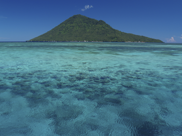
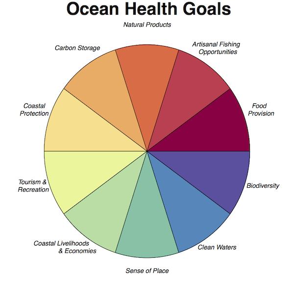
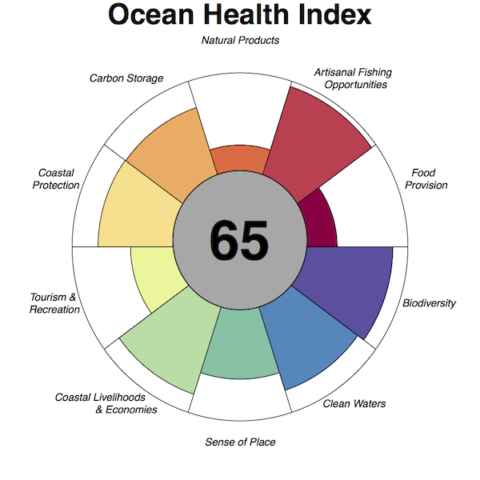
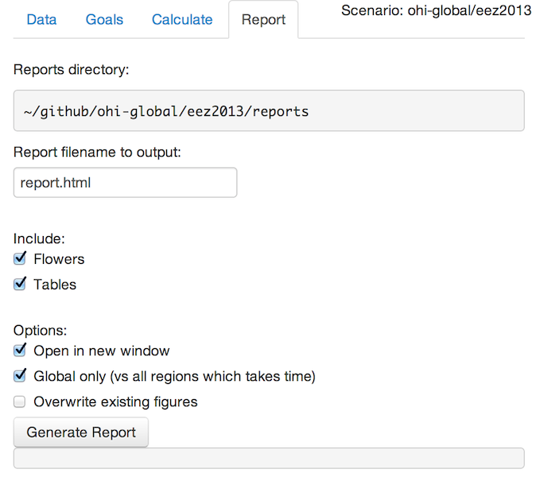

<div class='notes'>
- really 2 toolboxes
- 
</div>

## Toolboxes Motivated by Papers

1. Halpern et al 2008 _Science_: **Cumulative Impacts**
  

1. Halpern et al 2012 _Nature_: **Ocean Health Index**
  

<div class="notes">
Supplements: 46 pages, 118 pages

Abstract. Managing sustainable use of the oceans necessitates a comprehensive framework for quantifying the benefits to humans and man-made pressures on the oceans across a broad suite of services. A spatial and statistical toolbox is presented which enables custom Cumulative Impact Analysis and calculation of the Ocean Health Index. The toolbox includes a web front-end, R and Python packages, and a set of drag and drop form-based tools for use in either ArcGIS or an open-source GIS.
Ben Best - University of California Santa Barbara
</div>

# Cumulative Impacts

## Pressures (n=17)

- **Pollution**: fertilizer, pesticides, impervious surfaces, population density, ship traffic and ports

- **Fishing Pressure**: pelagic low-bycatch, pelagic high-bycatch, demersal destructive, demersal non-destructive low-bycatch, demersal non-destructive high-bycatch, artisanal

- **Climate Change**: sea temperature anomoly, ultraviolet radiation, ocean acidification, sea level rise (**_new_**)

- **Other**: invasive species, oil rigs, shipping

- 1 km2 pixels in Mollweide projection. Download at [nceas.ucsb.edu/globalmarine](http://www.nceas.ucsb.edu/globalmarine)
  

<div class='notes'>
n = 17 + 1 new
</div>

## Ecosystems (n=20)

- **Special**: coral, seagrass, mangrove, rocky reef, seamounts
- **Bottom Type and Depth**: soft or hard by shallow (0-60 m), shelf (60-200 m), slope (200 – 2000 m), deep (>2000 m)
- **Offshore Water Column**: pelagic (0 to 60 m in depths > 60 m), deep (60 m to bottom)

<div class="notes">
- also download at http://www.nceas.ucsb.edu/globalmarine
</div>

## Matrix of Weights: Ecosystem x Pressure


<div class="notes">
- greatest impact on mangrove w/ weight of 3.3 is direct human = population 
- whereas for coral reefs greatest impact is sea temperature anomoly
</div>

## Result


 
## Equation

$$
I_C = \sum_{i=1}^{n} \sum_{j=1}^{m} P_i * E_j * w_{i,j}
$$

> - $I_C$ cumulative impact score, per 1km pixel
> - $P_i$ log-transformed and normalized human pressure [0-1]
> - $E_j$ presence or absence of ecosystem $j$ [0,1]
> - $w_{i,j}$ weight for pressure $i$ and ecosystem $j$ [0-3.3]

<div class='notes'>
- like Weighted Overlay Analysis
</div>

## Tool in Model


## Tool Form 


## SeaSketch Integration

> - [impacts.seasketch.org](http://impacts.seasketch.org) by Dan Yocum, Will McClintock


## Next

- Download Python Toolbox at [github.com/ohi-science/cumimpacts](http://github.com/ohi-science/cumimpacts)

    - Linked from [ohi-science.org](http://ohi-science.org)
    
    - Soon linked from [nceas.ucsb.edu/globalmarine](http://www.nceas.ucsb.edu/globalmarine)

- Update with numpy matrix math for speed up: 2 hours to 20 seconds (Dan Yocum)

# Ocean Health Index

## What is a Healthy Ocean?

- Is it pristine?

    

- "A healthy ocean _sustainably_ delivers a range of _benefits_ to _**people**_ _now_ and in the _future_."

## 


## 



## 


## 



## 


## Dimensions


## Toolbox Goals
- **Recalculate** OHI globally or regionally using alternative weights, equations, layers, etc.
- **Regionalize** based on administrative boundaries finer than EEZ.
- **Visualize** results to highlight best opportunities for improving ocean health.
- **Interface** with easy-to-use forms for sliding weights and concocting scenarios.
- **Automate** with tools for manipulating input layers and calculating OHI scores for sensitivity analyses.

## Regionalize

<div class="columns-2">

**US West Coast**
Halpern et al (2014) _PLoS ONE_


**Brazil**
Elfes et al (2014) _PLoS ONE_


</div>

## Visualize

**Flower**


## Visualize

**Map**


## Process


```{r, echo=F, eval=F}
## Toolbox
suppressPackageStartupMessages({
  library(shiny)
  library(devtools); load_all('~/github/ohicore', quiet=T) # launch_app('~/github/ohi-global/eez2013')
  #library(ohicore)
  })

launch_app('~/github/ohi-global/eez2013', launch=F)
appDir='~/github/ohicore/inst/shiny_app'
source(file.path(appDir, 'global.R'), keep.source=T, encoding='UTF-8')
shinyAppDir(
  appDir,
  options=list(
    width="100%", height=700))
```

## Toolbox: Data | Map


## Toolbox: Data | Histogram


## Toolbox: Goals


## Toolbox: Calculate


## Toolbox: Report



## Toolbox: Report -> Result


## Regionalization Strategy

- examples
    - [Baltic](https://github.com/OHI-Science/ohiprep/tree/master/Baltic/StockholmUniversity-Regions_v2014-04#figure)
    - Israel [biogeographic](https://github.com/ohi-science/ohiprep/tree/master/Israel/Hamaarag-Regions_v2014a#israel-hamaarag-regions_v2014a) and [political](https://github.com/OHI-Science/ohi-israel/wiki/2014.06.11:-notes-from-virtual-meeting-on-regions-and-scenario-files#gadm-of-israel)

- globally
    - political: Global Administrative Areas ([GADM](http://gadm.org/))
    - biogeographic: Marine Ecoregions of the World ([MEOW](http://www.marineregions.org/sources.php#meow))
    - data:
        - pressures: extract from 1km Cumulative Impact rasters ([Halpern et al 2008](http://www.nceas.ucsb.edu/globalmarine), Halpern et al _in draft_)
        - other: weight country values from ohi-global by area / coastal population / ... of region
    - populate ohi-[country] scenario repository
    - deploy to ShinyApps.io for interactive website

## Scenario files

> - layers.csv, layers/
    + *.csv
- scenario.R, conf/
    + config.R
    + pressures_matrix.csv, resilience_matrix.csv, resilience_weights.csv
    + goals.csv
    + functions.R
- spatial/regions_gcs.js
- launchApp_code.R, launchApp.bat (Win), launchApp.command (Mac)
- scores.csv
- results/report.html, /figures

## Simulation

For example, calculate Baltic Health Index every year using scenarios `bhi1980,..., bhi2014` as folders.

```{r simulation, eval=FALSE}
library(ohicore)

for (dir_scenario in sprintf('~/ohibaltic/bhi%d', 1980:2014)){
  setwd(dir_scenario)
  
  conf   = Conf('conf')
  layers = Layers('layers.csv', 'layers')
  scores = CalculateAll(conf, layers)
  
  write.csv(scores, 'scores.csv')
}
```

## Software choices for reproducible science

free, cross-platform, open source, web based:

- **csv** (comma-seperated value) data files. ancillary: md, json, shp, geotiff
    + Excel poor with Unicode, file locking. Try [OpenOffice](https://www.openoffice.org/) instead. 
- [**R**](http://www.r-project.org/) having libraries `shiny` web application, `ggplot2` figures, `dplyr` data manipulation
    + [RStudio](http://www.rstudio.com) excellent front end
- [**Github**](http://github.com) repositories:
    + **backup** to offsite archive, and **rewind** changes
    + **document** changes of code and files with issues and messages
    + **collaborate** with others and **publish** to web site

## Github Repositories

`ohiprep` | `ohi-[scenario]` | `ohicore`


## OHI for Github

> 1. Install R library: `ohicore`

```{r install, eval=FALSE}
library(devtools)
install_github('ohi-science/ohicore')
```

1. Collaborate on a scenario: eg `ohi-global`
  - https://github.com/OHI-Science/ohi-global
  - **Download** ZIP, **Clone**, **Fork**

- [install script](http://ohi-science.org/pages/install.html)

## For More...

> - [ohi-science.org](http://ohi-science.org)

> - bbest@nceas.ucsb.edu

> - [bbest.github.io/talks/2014-07_ohi-cumimpacts_esri-uc](https://bbest.github.io/talks/2014-07_OHI-CumImpacts_ESRI-UC)
